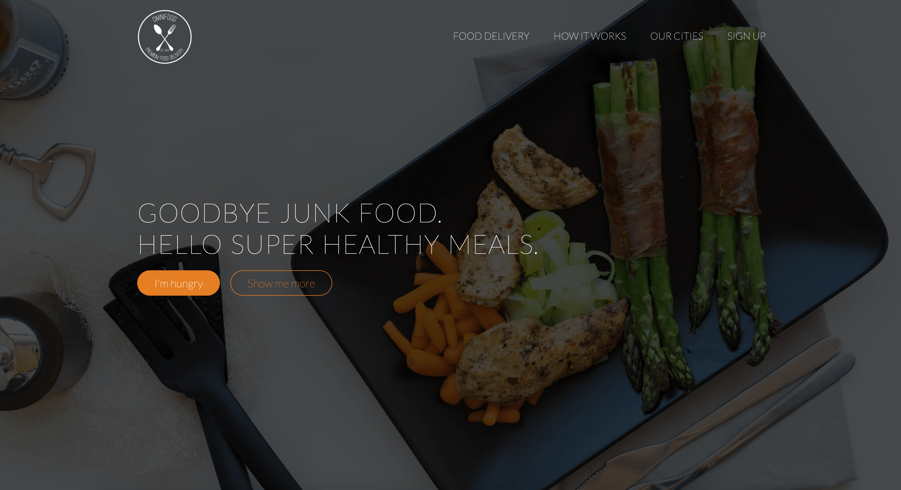
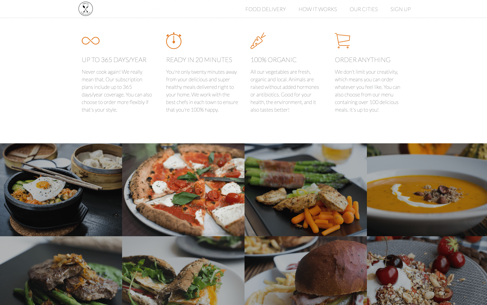
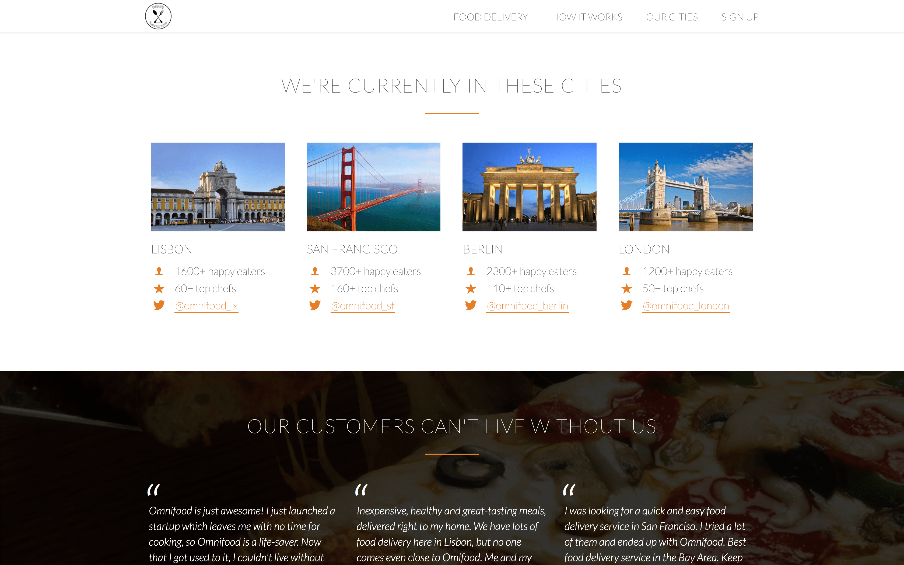

# Food app landing page template using HTML5 and CSS

This repo contains the finished project following instructions from Udemy course [Build Responsive Real World Websites with HTML5 and CSS3](https://www.udemy.com/course/design-and-develop-a-killer-website-with-html5-and-css3/) by Jonas Schmedtmann.

Production ready responsive website template for a food app. No bootstrap or similar framework, just clean HTML5, CSS and some jQuery for animations.

### &nbsp;

### &nbsp;

### &nbsp;

